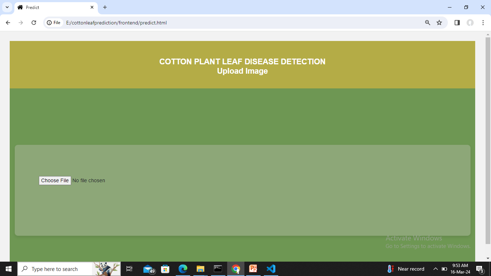
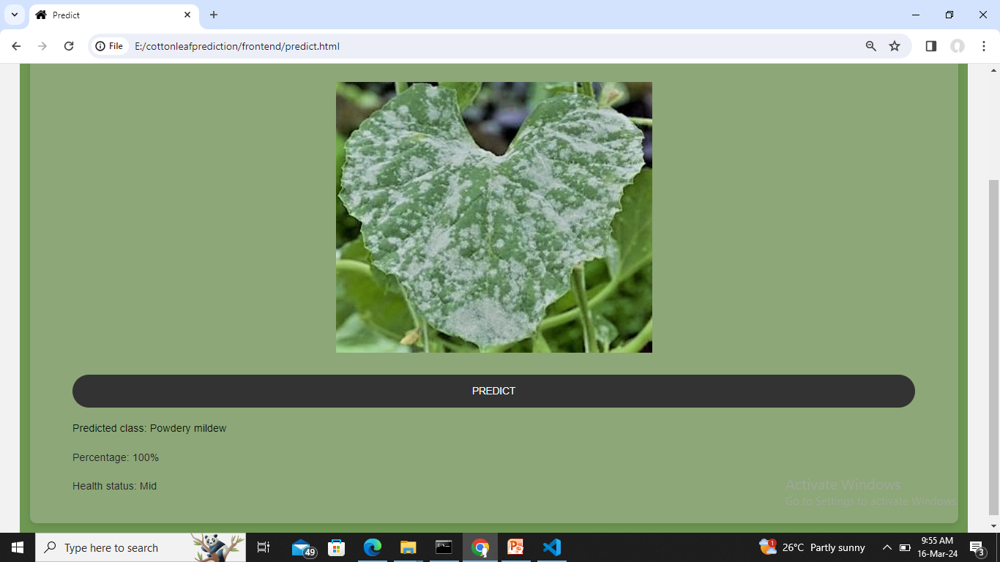

# 🌿 Cotton Leaf Disease Detection using Deep Learning

A full-stack AI-powered web application that automatically detects cotton leaf diseases and their severity stage using a MobileNetV2-based Convolutional Neural Network (CNN). The application allows users to upload an image of a cotton leaf and receive an instant prediction through a simple web interface.

---

## 📌 Project Overview

Cotton is one of the most important agricultural crops, and timely disease detection is essential for improving crop health and reducing yield loss.

This project uses **Transfer Learning with MobileNetV2** to classify cotton leaf diseases into different disease categories and severity stages. The model is integrated into a Flask web application, enabling users to upload leaf images and receive predictions in real time.

---

## ✨ Features

- Upload cotton leaf images
- Automatic disease detection
- Disease severity prediction (Early, Mid, Severe)
- Real-time prediction using Flask
- Simple and user-friendly interface
- Deep learning model with approximately **93% accuracy**

---

## 🛠 Technologies Used

### Programming Language
- Python

### Frontend
- HTML
- CSS
- JavaScript

### Backend
- Flask
- Flask-CORS

### Deep Learning
- TensorFlow
- Keras
- MobileNetV2

### Image Processing
- OpenCV
- NumPy

---

## 📂 Dataset

- Source: Kaggle
- Total Images: Approximately 4,800+
- Disease Classes: 6
- Severity Levels:
  - Early
  - Mid
  - Severe

---

## 📊 Model Performance

| Metric | Value |
|---------|-------|
| Model | MobileNetV2 |
| Accuracy | **93%** |
| Framework | TensorFlow/Keras |

---

## 📸 Application Screenshots

### Upload Page



---

### Prediction Result



---

## 📁 Project Structure

```
cotton-leaf-disease-detection
│
├── backend
│   ├── app.py
│   └── CottonPlantDisease.keras
│
├── frontend
│   ├── css
│   ├── js
│   ├── images
│   ├── vendor
│   ├── index.html
│   └── predict.html
│
├── screenshots
│   ├── upload-page.png
│   └── prediction-result.png
│
├── Cotton_Leaf_Disease_Detection.ipynb
├── requirements.txt
├── .gitignore
└── README.md
```

---

## ⚙ Installation

Clone the repository

```bash
git clone https://github.com/shivanij002/cotton-leaf-disease-detection.git
```

Install dependencies

```bash
pip install -r requirements.txt
```

Run the Flask server

```bash
cd backend
python app.py
```

Open the frontend in your browser and upload a cotton leaf image for prediction.

---

## 🚀 Future Enhancements

- Mobile application
- Cloud deployment (AWS)
- Real-time camera detection
- Additional crop disease support
- Improved UI/UX

---

## 👩‍💻 Author

**Shivani J**

GitHub:
https://github.com/shivanij002

---

If you found this project useful, consider giving it a ⭐ on GitHub.